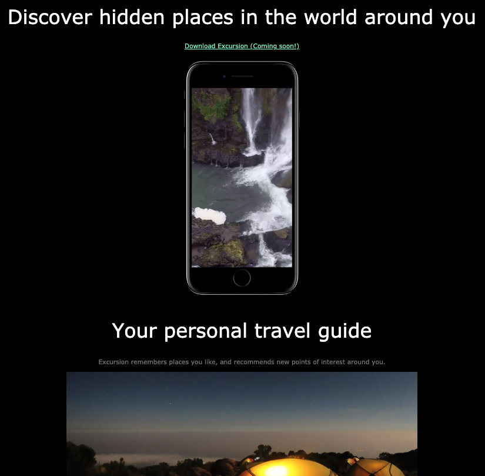

# My first project 

This is the firs project I created withiin the Codecademy.com 'Full Stack Engineer' course.

It's a static page showing some text, images and a video.

**Technologies:** HTML, CSS.

**Deployment:** using GitHub pages https://pabloferg.github.io/codecademy-excursion/

